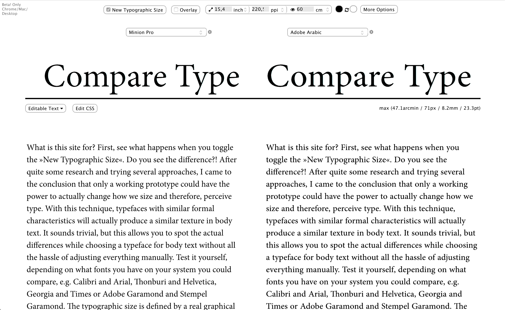
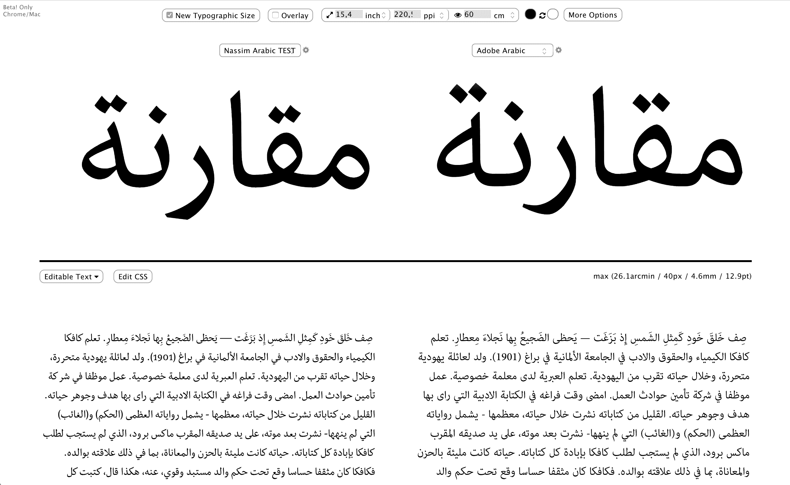
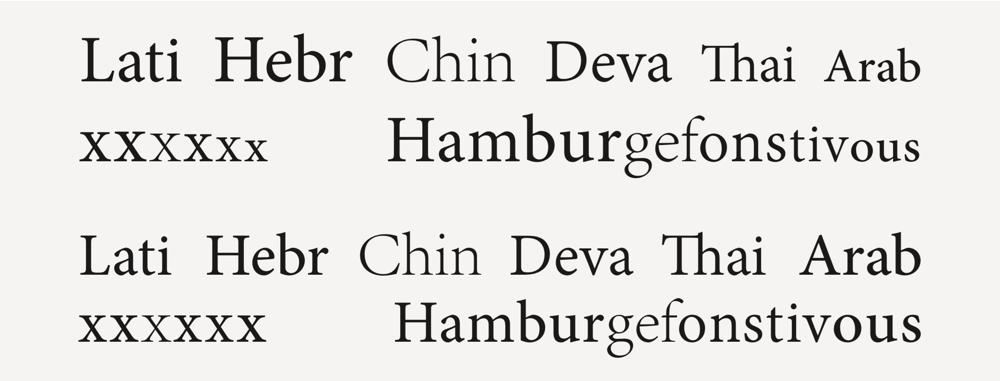
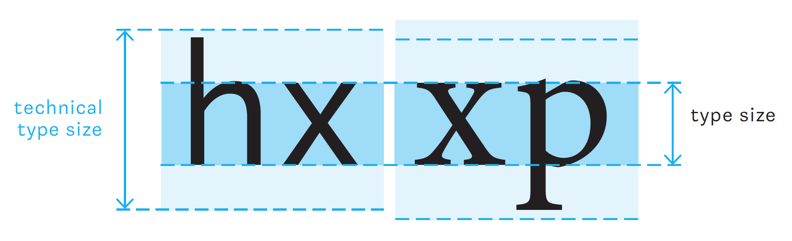

# Comparetype

Tool to compare fonts at a normalized typographic size.

**Demo** (external)
- [Latin Version](http://vongebhardi.de/comparetype/github/) (English)
- [Arabic Version](http://vongebhardi.de/comparetype/github/arabic.html)
- [Greek Version](http://vongebhardi.de/comparetype/github/greek.html)
- [Hebrew Version](http://vongebhardi.de/comparetype/github/hebrew.html)

**Features**
- normalizes typographic size
- normalizes baseline position
- script-sensible sizing
- mode for all-caps setting
- detects installed fonts (script specific)
- testing with physical sizes (you need to input your screens specifications)
- allows to set line-height relative to typographic size

**Current main limitation - Sizing the body text**
- currently it is only possible to change the actual type size via the specification in global.js
- workaround: to quickly change the size use the reading distance field (double the distance, double the size)

**Preview**

**One issue caused by the current technical model**

Different versions of Minion are differently scaled to accompany
type designs of other scripts; Top: original
setting; Bottom: scaled to the same x-height.

**Technical Type Size**

